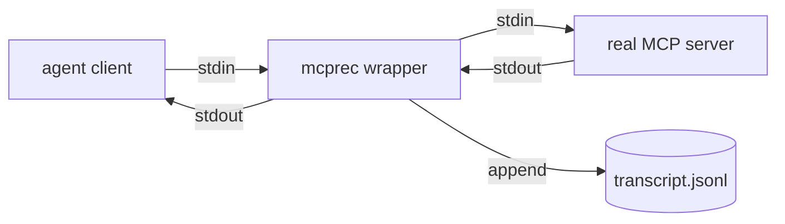

<div align="center">

# `mcprec`

### record & replay any MCP server

**Capture stdio. Replay deterministically. Test agent tools without the network.**

[](./LICENSE)
[](#roadmap)

</div>

A transparent MCP middleware. Wraps a stdio MCP server, captures every
JSON-RPC frame in both directions to a transcript, and replays that
transcript as a fake server later. Deterministic fixtures for agent tests
that would otherwise hit the network.

> **The thesis.** Agent tests are flaky because tools are flaky — the
> Linear API hiccups, GitHub rate-limits, the Slack workspace changes.
> The way out is the same as for HTTP: record once, replay forever,
> re-record only when the contract actually changes. `mcprec` is VCR for MCP.

---

## ✦ Modes

```bash
mcprec record --out fixture.jsonl -- npx @modelcontextprotocol/server-github
mcprec replay fixture.jsonl
mcprec inspect fixture.jsonl       # pretty-print a recorded session
mcprec diff a.jsonl b.jsonl        # contract-drift detection
```

`record` is a passthrough — your agent talks to the real server, every
frame is logged. `replay` matches incoming requests against the
transcript by `(method, params)` and serves the recorded response.
Mismatches fail loudly.

## ✦ Transcript format

Newline-delimited JSON, one frame per line, with direction + timestamp:

```jsonl
{"t": 0.000, "dir": "→", "msg": {"jsonrpc":"2.0","id":1,"method":"initialize"}}
{"t": 0.012, "dir": "←", "msg": {"jsonrpc":"2.0","id":1,"result":{"...":"..."}}}
{"t": 0.043, "dir": "→", "msg": {"jsonrpc":"2.0","id":2,"method":"tools/call","params":{"name":"search_issues"}}}
{"t": 0.890, "dir": "←", "msg": {"jsonrpc":"2.0","id":2,"result":{"content":[]}}}
```

Plain text. Diffable. Hand-editable when you need to redact a token.

## ✦ How



In replay mode, the real server is replaced by a transcript-backed
responder.

## ✦ Why not just mock?

Mocks lie. They drift. They encode what the test author *thinks* the
server returns, not what it actually returns. A recorded transcript is
the ground truth — and when the server changes, your `replay` fails fast
and tells you which frame diverged.

## ✦ Roadmap

- [ ] v0.1 — record/replay for stdio MCP, exact `(method, params)` match
- [ ] v0.2 — fuzzy match (ignore monotonic ids, normalize timestamps)
- [ ] v0.3 — `inspect` and `diff` commands
- [ ] v0.4 — HTTP/SSE transport support
- [ ] v0.5 — secret redaction on record (`--redact authorization,api_key`)
- [ ] v1.0 — used in `erphq/neo` and `erphq/enterprise-skills` test suites

## ✦ License

MIT — see [LICENSE](./LICENSE).
