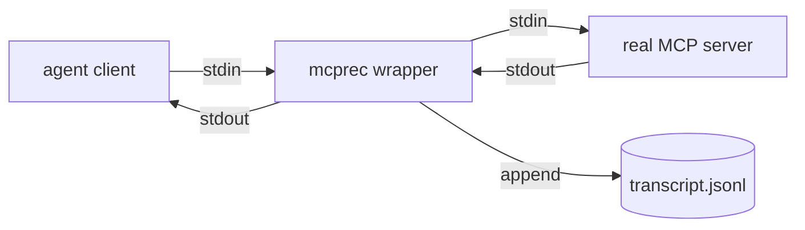

<div align="center">

# `mcprec`

### record & replay any MCP server

**Capture stdio. Replay deterministically. Test agent tools without the network.**

[](./LICENSE)
[](#roadmap)
[](#install)

</div>

A transparent middleware for the Model Context Protocol. Wraps any
stdio MCP server, captures every JSON-RPC frame to a transcript, and
replays that transcript later as a fake server. The result:
deterministic, network-free, billing-free fixtures for agent tests
that would otherwise be flaky against a live API.

> **The thesis.** Agent tests are flaky because tools are flaky — the
> Linear API hiccups, GitHub rate-limits, the Slack workspace changes
> overnight. The way out is the same as for HTTP: record once against
> a real server, replay forever, only re-record when the contract
> actually changes. `mcprec` is VCR for MCP.

---

## ✦ The flakiness problem

Tests for agent tools have three failure modes:

1. **Network flakes.** The remote service blips; your CI run fails for
   reasons unrelated to your code.
2. **Rate limits.** Many runs in parallel exhaust quota.
3. **Drift.** A field gets renamed remotely; tests pass on Tuesday,
   fail on Wednesday.

Mocking the tool fixes (1) and (2) but makes (3) silent: your mock
returns what you *think* the server returns. By the time it diverges,
your tests are validating fiction.

`mcprec` captures the actual wire bytes once, then replays them. Tests
are deterministic. Drift is detected (replay fails when a method/params
combo no longer matches the recording). Re-recording is one command.

## ✦ Install

```bash
npm install -g mcprec
# or one-shot:
npx mcprec record --out fixture.jsonl -- npx @modelcontextprotocol/server-github
```

## ✦ Modes

### Record

```bash
mcprec record --out fixtures/github.jsonl -- \
  npx @modelcontextprotocol/server-github
```

Your agent talks to the real `server-github` over stdio; every JSON-RPC
frame in both directions lands in `github.jsonl`. The MCP server runs
exactly as it would normally — no proxy URL, no certificate
shenanigans, nothing for it to detect.

### Replay

```bash
mcprec replay fixtures/github.jsonl
```

The binary that gets exec'd by your agent is now `mcprec replay`. It
serves the recorded transcript as a fake MCP server, matching by
`(method, params)`. Mismatch → loud error, full diff.

### Inspect

```bash
mcprec inspect fixtures/github.jsonl
```

Pretty-prints a recorded session: timeline view of requests and
responses, syntax-highlighted JSON, inferred contract (which methods,
which tools, how many calls each).

### Diff

```bash
mcprec diff fixtures/github.old.jsonl fixtures/github.new.jsonl
```

Compares two transcripts. Surfaces contract drift: methods that now
return new fields, methods that no longer exist, parameter shapes that
changed. The fixture-update workflow.

## ✦ Transcript format

Newline-delimited JSON. One frame per line. Direction + relative
timestamp + the original message:

```jsonl
{"t":0.000,"dir":"→","msg":{"jsonrpc":"2.0","id":1,"method":"initialize"}}
{"t":0.012,"dir":"←","msg":{"jsonrpc":"2.0","id":1,"result":{"capabilities":{}}}}
{"t":0.043,"dir":"→","msg":{"jsonrpc":"2.0","id":2,"method":"tools/call","params":{"name":"search_issues","arguments":{"q":"is:open"}}}}
{"t":0.890,"dir":"←","msg":{"jsonrpc":"2.0","id":2,"result":{"content":[{"type":"text","text":"..."}]}}}
```

Plain text. Diffable in PRs. Hand-editable when you need to redact a
token. Friendly to git, friendly to humans, friendly to CI.

## ✦ Why not just mock?

| | Mock | Snapshot tests | `mcprec` |
|---|---|---|---|
| Source of truth | Author's belief | Real once | Real always |
| Catches drift | No | Sometimes | Always (replay fails) |
| Re-record on contract change | Manual rewrite | Manual | One command |
| Setup cost | High (write the mock) | Medium | Low (just run once) |
| Wire-level fidelity | None | Output only | Full JSON-RPC |

Mocks lie. They drift. They encode what the test author *thinks* the
server returns, not what it actually returns. Snapshot tests catch some
of that but only at the result level, not the protocol level. `mcprec`
captures the whole conversation.

## ✦ Worked example

You're building an agent that uses the GitHub MCP server. You want
hermetic tests for the `search_issues → comment_on_issue` flow.

```bash
# 1. Record a real run once
GITHUB_TOKEN=$REAL_TOKEN \
  mcprec record --out fixtures/github-issue-flow.jsonl \
  --redact GITHUB_TOKEN \
  -- npx @modelcontextprotocol/server-github
# (run your agent end-to-end, then ctrl-c)

# 2. Commit the transcript
git add fixtures/github-issue-flow.jsonl

# 3. In CI / dev, replay instead
mcprec replay fixtures/github-issue-flow.jsonl
# (your agent connects, gets the same answers, deterministically)
```

When the GitHub MCP server adds a new field, your `replay` flags the
delta and you re-record. No silent passes against stale mocks.

## ✦ How



In replay mode, the real server is replaced by a transcript-backed
responder.

## ✦ Programmatic API

```ts
import { record, replayServer } from "mcprec";

// In a test setup:
const session = await record({
  command: ["npx", "@modelcontextprotocol/server-github"],
  out: "fixtures/test.jsonl",
  redact: ["GITHUB_TOKEN"],
});
// ... drive the agent ...
await session.close();

// In a test:
const fake = replayServer("fixtures/test.jsonl");
// Hand fake.stdio to your MCP client.
```

## ✦ Matching strategies

The default matcher is exact `(method, params)` equality after
normalizing whitespace and key order. Real-world recordings are noisier;
`mcprec` ships layered matchers:

1. **Exact** — strict equality
2. **Normalized** — drop monotonic ids, normalize timestamps, sort keys
3. **Schema-loose** — match `(method, paramsKeys)` only
4. **User-supplied** — pass a `match: (req, recorded) => boolean` function

`replay` walks the strategies in order; the first match wins.

## ✦ Secret redaction

`record --redact` replaces matching values with `<REDACTED>` in the
transcript before it's written to disk. Glob-match keys, regex-match
values, or pass a redactor function. Default redactors strip:

- `Authorization` headers
- `*_token`, `*_key`, `*_secret` keys
- Anything that looks like a JWT or a PEM block

Belt and suspenders: review your transcript before committing.

## ✦ Anti-patterns

| Anti-pattern | Why it's bad |
|---|---|
| Hand-editing transcripts to add new responses | Loses the "real once" property; you're back to mocking |
| Recording in production with real user data | Now your fixture is a privacy liability |
| One giant transcript per repo | Brittle — any contract change invalidates the whole file |
| Exact matching with monotonic IDs | Replay fails on the second run because IDs incremented |

## ✦ Non-goals

- Building yet another MCP server framework
- Recording non-MCP protocols (use [VCR](https://vcr.readthedocs.io/) for HTTP)
- Encrypted transcripts (use filesystem permissions or `git-crypt`)
- Live transcript streaming to a remote service

## ✦ FAQ

**Q: My MCP server is non-deterministic (random IDs, timestamps). How do I match?**
A: Use the `Normalized` matcher (default) — it strips monotonic ids and
normalizes timestamps. For deeper non-determinism, supply a custom
matcher.

**Q: How do I update fixtures?**
A: Re-run `record`. The diff against the old fixture is what your PR
reviews.

**Q: Does this work with HTTP-transport MCP servers?**
A: Not in v0.1 — stdio only. v0.4 adds HTTP/SSE.

**Q: Why JSONL instead of a binary format?**
A: Diff-friendliness. Test fixtures live in git, get reviewed in PRs,
get hand-edited to redact secrets. Plain text wins.

**Q: Can I use `mcprec` to debug a flaky MCP server?**
A: Yes — `record` followed by `inspect` is a useful diagnostic flow,
even if you never replay.

## ✦ Roadmap

- [x] v0.0 — scaffold, design, schema
- [x] v0.1 — record/replay for stdio MCP, exact `(method, params)` match, secret redaction on record
- [x] v0.2 — fuzzy matcher tier (ISO timestamps · UUIDs · id-shaped keys)
- [x] v0.3 — `inspect` and `diff` commands
- [x] v0.4 — HTTP transport replay (JSON request → JSON response)
- [x] v0.4.1 — SSE streaming for HTTP replay (auto-detect multi-frame responses; `streaming: 'auto' \| 'off'`)
- [x] v0.4.2 — HTTP record-mode proxy (`mcprec record-http --target`); transcripts byte-compatible with stdio recording
- [x] v0.5 — pluggable matcher API (`UserMatcher` callback consulted before built-in tiers)
- [ ] v1.0 — used in `erphq/neo` and `erphq/enterprise-skills` test suites

## ✦ Topics

`mcp` · `model-context-protocol` · `claude` · `ai-agents` · `testing` ·
`vcr` · `fixtures` · `jsonrpc` · `typescript` · `cli` · `devtools` ·
`hermetic-testing`

## ✦ License

MIT — see [LICENSE](./LICENSE).
